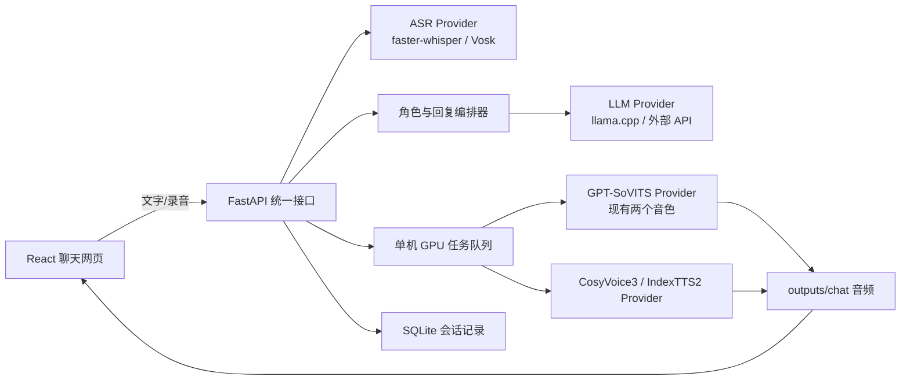
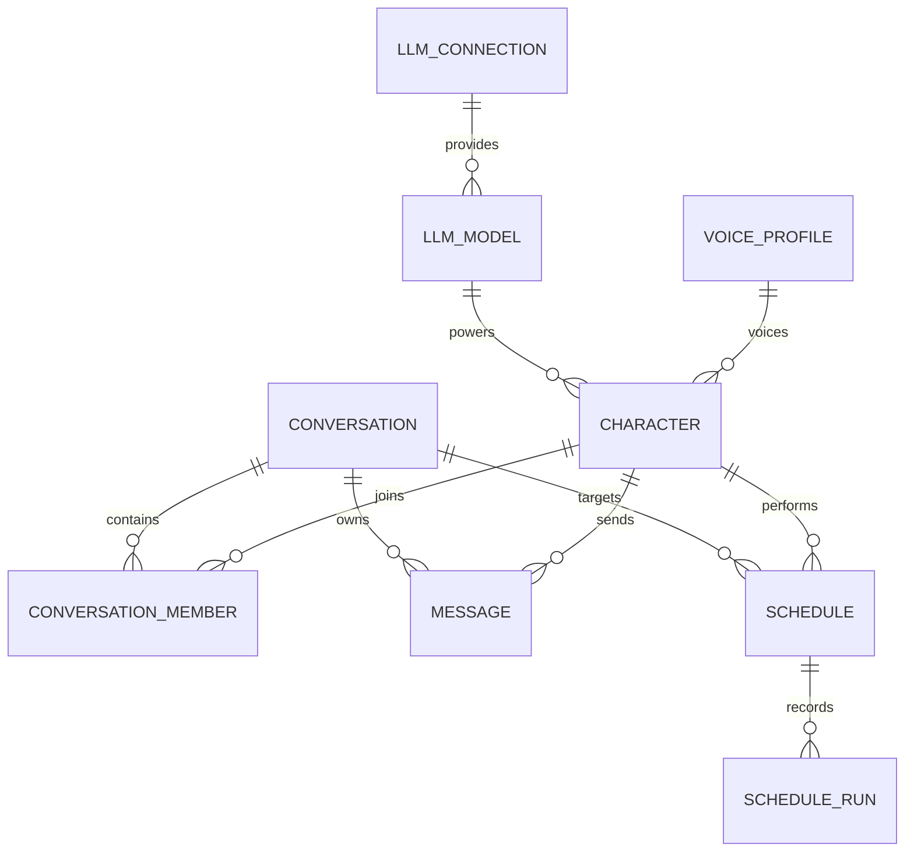

# 本地网页语音聊天重构方案

更新时间：2026-08-21

## 1. 结论

建议把当前项目重构成一个本地网页应用，采用以下组合：

- 网页：React + Vite + TypeScript
- 统一后端：FastAPI
- 对话模型：本地 llama.cpp，或通过 API Key 接入 OpenAI 兼容的网页大模型
- 语音输入：浏览器 `MediaRecorder` + faster-whisper；Vosk 保留为低配置回退
- 第一阶段语音输出：继续使用现有 GPT-SoVITS 两套音色 `aiyafala`、`changli`
- 推荐替换引擎：优先测试 Fun-CosyVoice3-0.5B；同时测试 IndexTTS2 作为情绪质量对照
- 多人聊天：每个“角色档案”独立绑定名字、头像、人物设定、LLM 服务/模型和 TTS 音色
- 定时任务：后端持久化执行一次性或循环任务，自动把角色消息写入指定会话并合成对应声音
- 存储：SQLite 保存会话和消息元数据，WAV 文件保存到 `outputs/chat/`

不要一开始删除 GPT-SoVITS。先让统一网页完整跑通，再用同一批文本和参考音频横向比较新引擎，确认音色相似度、情绪、速度和稳定性后再决定替换。

## 2. 用户使用流程

1. 打开本地网页，进入单人或多人会话，选择要交谈的角色，也可直接使用 `@角色名`。
2. 在输入框打字，或者点击麦克风录音。
3. 录音上传后自动识别成文字，用户可在发送前修改。
4. 后端根据角色档案，把文字和历史对话发送给该角色绑定的本地模型或网页模型 API，网页逐字显示回答。
5. 一句话结束后进入 TTS 队列，自动使用消息所属角色绑定的音色和情绪生成音频。
6. 网页自动播放，也可暂停、重播、下载，或用另一种情绪重新生成。

状态应明确显示为：`录音中 → 识别中 → 思考中 → 合成中 → 可播放`。

## 3. 推荐架构



后端不应直接绑定某一个模型。统一定义三个接口，并由角色档案建立组合关系：

- `LLMProvider.stream_chat(messages)`：流式返回文本。
- `ASRProvider.transcribe(audio)`：返回识别文本。
- `TTSProvider.synthesize(text, voice, emotion)`：返回音频和合成参数。

这样以后替换 llama.cpp、Whisper、GPT-SoVITS 或 CosyVoice 时，网页和会话逻辑不用重写。

## 4. 网页界面

桌面端使用“左侧会话列表 + 中间聊天区 + 右侧会话成员”的结构；系统设置使用独立页面或抽屉，手机端把左右区域收起。

聊天区包含：

- 用户与多个角色的消息气泡；角色消息显示头像、名字和对应颜色，回答边生成边显示。
- AI 消息下方的播放/暂停、重播、下载、重新合成按钮。
- 底部输入栏：文本框、麦克风、`@角色`、发送、停止本轮生成。
- 顶部快捷项：本轮回复方式、自动播放、会话级情绪模式。
- 右侧成员区：角色在线/生成/合成状态、静音、是否参加下一轮回复。
- 每条角色消息的更多菜单：换情绪重新合成、临时换音色、复制文本；临时切换只影响该消息，不修改角色默认配置。

第一版情绪预设可设为：`自动、平静、开心、悲伤、愤怒、惊讶、温柔、严肃`。底层不支持某项时由 Provider 映射为参考音频、文本指令或强度参数。

## 5. 为什么选 FastAPI + React

FastAPI 适合音频上传、流式文字、异步任务和后续 WebSocket；React 更适合维护聊天记录、录音状态、音频播放器和响应式布局。

Gradio 可以快速做模型试验页，但不建议作为最终聊天界面。它适合验证模型，不适合长期维护完整的会话历史、细粒度状态、消息级重播和自定义交互。

## 6. 本地对话模型

使用 llama.cpp 的 `llama-server` 替换 Ollama 依赖：

- 直接加载 GGUF 量化模型。
- 提供 OpenAI 兼容 `/v1/chat/completions` 接口和流式输出。
- 可以调节多少层放到 GPU，便于给 ASR/TTS 留显存。
- 后端只依赖标准 HTTP 接口，以后换回 Ollama 或其他 OpenAI 兼容服务也不影响网页。

11GB 显存下建议先使用 7B/8B 的 Q4 GGUF、上下文 4096，并根据实际峰值调整 GPU offload。

官方资料：[llama.cpp server](https://github.com/ggml-org/llama.cpp/blob/master/tools/server/README.md)

外部网页模型统一优先按 OpenAI 兼容协议接入。一个连接记录服务地址和 API Key，一个角色再选择该服务中的具体模型。这样可以实现：

- 艾雅法拉 → DeepSeek/Qwen/OpenAI 等某个网页模型 → aiyafala 音色。
- 长离 → 另一个服务或另一个模型 → changli 音色。
- 两个角色也可以共用一个 API Key，但使用不同模型和不同人物提示词。
- 某个外部 API 不可用时，可为角色设置本地 llama.cpp 回退模型。

官方异步客户端支持自定义 `base_url` 与 `api_key`：[OpenAI compatible model clients](https://github.com/openai/openai-agents-python/blob/main/docs/models/index.md)。

## 7. 语音输入

浏览器负责录音，后端负责识别。推荐用 faster-whisper 的 `small` 或 `large-v3-turbo` INT8 模式，原因是其相对原版 Whisper 速度更快、内存占用更低，并集成 VAD。

第一版可采用以下策略：

- 短句聊天：faster-whisper 在 CPU INT8 运行，不占 GPU。
- 需要更高速度时：进入统一 GPU 队列，用 GPU INT8 识别后立即释放。
- Vosk 作为离线低资源回退，现有中文模型继续保留。
- 当前 Whisper Medium 继续用于视频数据处理，不必作为网页短句默认模型。

官方资料：[faster-whisper](https://github.com/SYSTRAN/faster-whisper)

## 8. 音色引擎比较

| 方案 | 克隆已有音色 | 情绪控制 | 模型/资源 | 许可 | 适合本项目的结论 |
|---|---|---|---|---|---|
| 现有 GPT-SoVITS | 已有两个训练模型 | 当前接入无显式情绪控制 | 已验证可在 RTX 2080 Ti 上运行 | MIT | 第一阶段基线，先优化常驻加载 |
| Fun-CosyVoice3 | 零样本、跨语言克隆 | 自然语言指令；情绪、方言、语速、音量；可结合参考音色 | 0.5B，支持文字/音频双流式，官方称首包最低约 150ms | Apache-2.0 | **首选替换候选**，最适合网页实时对话 |
| IndexTTS2 | 零样本克隆 | 情绪参考音频、情绪文本、8 维情绪向量，音色与情绪解耦 | 约 1.5B，支持 FP16 | 自定义模型许可 | **情绪质量对照首选**，商业使用前需审查许可 |
| Qwen3-TTS | 3 秒参考音频克隆 | 1.7B CustomVoice/VoiceDesign 支持自然语言控制；Base 克隆模型当前未标注指令控制 | 0.6B/1.7B，流式，官方称最低约 97ms | Apache-2.0 | 很新且值得测试，但“任意克隆音色 + 指定情绪”暂不如 CosyVoice3 接口直接 |
| Chatterbox Multilingual V3 | 零样本克隆，支持中文 | `exaggeration` 情绪夸张强度 | 约 500M | MIT | 安装和许可友好，但情绪类型控制较粗 |
| Fish Audio S2 Pro | 10–30 秒零样本克隆 | 文字内联自由情绪标签，控制最细 | 4B，官方高性能数据使用 H200 | Fish Audio Research License | 质量强但对本机偏重，许可也不适合作为首选 |
| F5-TTS | 零样本克隆 | 主要依赖参考音频风格 | 约 0.3B | 代码 MIT，预训练模型 CC-BY-NC | 轻量但情绪控制不足，且预训练权重非商用 |

官方仓库：

- [CosyVoice](https://github.com/QwenAudio/CosyVoice)
- [IndexTTS2](https://github.com/index-tts/index-tts)
- [Qwen3-TTS](https://github.com/QwenLM/Qwen3-TTS)
- [Chatterbox](https://github.com/resemble-ai/chatterbox)
- [Fish Speech](https://github.com/fishaudio/fish-speech)
- [F5-TTS](https://github.com/SWivid/F5-TTS)
- [GPT-SoVITS](https://github.com/RVC-Boss/GPT-SoVITS)

## 9. 推荐替换路线

### 第一步：网页整合，不替换模型

- 把 Flask 服务改为 FastAPI。
- 接入 llama.cpp 流式对话。
- 封装现有 GPT-SoVITS Provider，服务启动时加载模型，避免每条消息重新载入。
- 读取 `config/voices.yaml`，网页显示 aiyafala/changli。
- 加入麦克风输入、文字显示、自动播放和消息级重播。

完成标准：两个现有音色都能在同一网页中连续对话，不再依赖命令行。

### 第二步：并行测试新音色引擎

优先建立 CosyVoice3 Provider，再建立 IndexTTS2 Provider。使用完全相同的：

- 两段现有角色参考音频；
- 20 条固定中文测试句；
- 8 种情绪；
- 长短句、数字、英文夹杂、疑问句和感叹句。

记录音色相似度、情绪可辨识度、首包时间、总耗时、峰值显存、错读率和长句稳定性。网页设置中暂时允许切换三种 TTS 引擎，方便盲听比较。

### 第三步：确定正式引擎

- 如果 CosyVoice3 的角色相似度达到现有模型水平：将其设为默认，GPT-SoVITS 保留兼容回退。
- 如果 IndexTTS2 的情绪明显更好且许可可接受：允许高质量模式切换到 IndexTTS2。
- Qwen3-TTS 后续若开放“Base 克隆 + 指令控制”的统一接口，再加入测试，不必现在押注。

## 10. 显存与进程隔离

这台 RTX 2080 Ti 为 11GB，不能假设 LLM、Whisper Medium 和多个 TTS 都能同时满载常驻。

建议：

- Web/API 使用主 Python 环境。
- llama.cpp 使用独立进程和 GGUF。
- GPT-SoVITS、CosyVoice3、IndexTTS2 各用独立 Python 环境/进程，避免 Torch、Transformers 和 Python 版本冲突。
- 使用单个 GPU 队列，不让 ASR 与 TTS 同时抢显存。
- LLM 采用可调 GPU offload；ASR 默认 CPU INT8。
- 第一阶段只常驻当前选中的一个 TTS 引擎；两个角色的参考特征可预计算并缓存。

不建议在单个 `.venv` 中同时安装全部候选 TTS。它们锁定的 Torch/Transformers 版本不同，会破坏当前已经验证的 GPT-SoVITS 环境。

## 11. 建议目录

```text
app/
  api/                 FastAPI 路由
  services/            对话、会话和任务编排
  providers/
    llm/               llama.cpp / Ollama 适配器
    asr/               faster-whisper / Vosk 适配器
    tts/               GPT-SoVITS / CosyVoice3 / IndexTTS2 适配器
web/                    React + Vite 前端
config/
  app.yaml
  voices.yaml
data/
  voices/              角色参考音频和提示文本
outputs/
  chat/                每个会话的生成音频
runtime/                本地模型服务启动配置，不提交大模型
```

## 12. 第一版验收标准

- 文字输入和麦克风输入都能完成一次完整对话。
- AI 文本流式显示，回答完成后自动合成并播放。
- aiyafala/changli 可切换，连续各生成至少 10 次不重新加载整套模型。
- 每条 AI 消息都可重播、下载、重新合成。
- 刷新网页后能恢复历史文字和已有音频。
- 模型失败时显示明确错误，不丢失已生成的文字回答。
- 11GB 显存下不会因并行加载导致整套程序崩溃。

## 13. 角色档案：名字、模型和音色的绑定中心

每个角色包含以下设置：

| 分组 | 字段 |
|---|---|
| 身份 | 显示名称、头像、主题颜色、简介、启用状态 |
| 大脑 | LLM 连接、模型名、系统提示词、温度、回答长度、上下文长度、失败回退模型 |
| 声音 | TTS Provider、音色 ID、参考音频、默认语言、默认情绪、语速、音量 |
| 群聊 | 回复优先级、是否自动参与、是否允许回应其他角色、每轮最多回复次数 |
| 定时 | 可使用该角色的任务列表、每日调用/费用限制 |

第一阶段的默认映射为：

| 角色名 | LLM | TTS |
|---|---|---|
| 艾雅法拉 | 用户在设置中选择本地或外部模型 | GPT-SoVITS `aiyafala` |
| 长离 | 用户在设置中选择本地或外部模型 | GPT-SoVITS `changli` |

消息不能只保存最终 WAV 路径，还要保存生成时的角色、LLM、TTS、音色和情绪快照。这样以后修改角色配置，历史消息仍然知道自己原来使用了什么声音。

## 14. 多人聊天回复规则

第一版提供三种明确模式：

1. **指定角色**：点击头像或输入 `@艾雅法拉`，只有被指定角色回答。这是默认模式。
2. **依次回答**：勾选多个角色，按照成员顺序逐个回答；后面的角色能看到前面的回答。
3. **全员独立回答**：多个角色都只根据用户问题回答，不把其他角色本轮内容作为输入，适合比较不同模型。

后续可增加“主持人自动选择角色”，但第一版不让 LLM 自由决定无限互聊。每个用户输入只创建一个有限的 `reply round`，包含：

- 最多回复角色数，默认 2。
- 每个角色本轮最多回复 1 次。
- 总字符数和总生成时间上限。
- 页面上的“停止本轮”按钮。
- 外部 API 的每轮费用/令牌上限。

每条角色消息完成文字生成后，立即用该角色绑定音色合成。播放队列默认按消息顺序播放，不会让两段角色语音重叠。

## 15. 外部 API 与密钥安全

设置页中的“AI 服务”包含：

- 服务显示名，例如“DeepSeek 主账号”。
- API 类型，第一版为 OpenAI Compatible 或本地 llama.cpp。
- `base_url`、默认模型、超时、重试次数。
- API Key 输入框，只允许写入、替换和删除，不提供明文读取。
- “测试连接”和“获取/填写模型名”操作。
- 每日令牌或费用提醒，定时任务可设置更低的独立上限。

API Key 只从浏览器提交一次给 FastAPI，然后保存到 Windows Credential Locker；SQLite 仅保存 `credential_ref`、是否已配置和末尾掩码。密钥不能出现在：

- React 源码或构建产物；
- 浏览器 localStorage/IndexedDB；
- `config/*.yaml`、SQLite 明文字段；
- 请求日志、错误日志、聊天导出；
- 返回给网页的 API 响应。

Python `keyring` 支持 Windows Credential Locker：[keyring 文档](https://keyring.readthedocs.io/en/latest/index.html)。Windows 官方也建议不要硬编码 API Key，并使用系统凭据库保存秘密：[Microsoft 密钥处理建议](https://learn.microsoft.com/en-us/windows/win32/secbp/handling-passwords)。

服务默认只监听 `127.0.0.1`。如果以后允许局域网访问，需要额外增加登录、HTTPS、允许来源列表和操作审计，不能直接把带有 API Key 的设置接口暴露到局域网。

## 16. 定时任务

定时任务由 FastAPI 后端中的持久化调度器执行，不依赖浏览器 `setTimeout`。推荐使用 APScheduler + SQLite；官方文档说明，要在程序重启后保留任务必须使用持久化数据存储：[APScheduler User Guide](https://apscheduler.readthedocs.io/en/master/userguide.html)。

任务支持：

- 触发方式：指定日期时间、每隔一段时间、每天/每周固定时间。
- 时区：默认 `Asia/Shanghai`。
- 目标：指定会话和一个角色，也可以指定按顺序回复的多个角色。
- 内容类型：固定文本、固定提示词调用 LLM、基于该会话上下文继续聊天。
- 输出：只写文字、文字 + TTS、文字 + TTS + 尝试自动播放。
- 错过策略：跳过、重新打开后补执行一次；默认跳过，避免集中补发。
- 安全限制：同一任务不可并发、失败重试次数、最长执行时间、每日次数和 API 费用上限。
- 记录：最近运行时间、下次运行时间、结果、错误、使用的角色/模型/音色。

只要后端程序一直开着，任务就会按时生成并保存。如果整个程序关闭，任务不会在关闭期间执行；再次打开后按“错过策略”处理。如果以后希望开机后自动运行，可再接入 Windows 任务计划程序启动后端。

浏览器对无用户交互的有声自动播放有限制，后台标签页也可能暂停自动声音。因此首次进入页面提供“启用自动播放”按钮；如果定时消息到达时被浏览器拦截，消息和音频仍然保存，并显示系统通知及“待播放”标记。相关限制见 [MDN 自动播放指南](https://developer.mozilla.org/en-US/docs/Web/Media/Guides/Autoplay)。

## 17. 数据关系



建议的数据表为：`llm_connections`、`llm_models`、`voice_profiles`、`characters`、`conversations`、`conversation_members`、`messages`、`reply_rounds`、`schedules`、`schedule_runs`。API Key 不在这些表中，只保存系统凭据引用。

## 18. 多角色版本验收标准

- 可创建、修改、复制和停用角色档案。
- 艾雅法拉和长离能分别绑定不同 LLM/API 和不同音色。
- `@角色`、依次回答、全员独立回答三种模式可用，不产生无限自动对话。
- 每条角色消息自动使用对应音色，历史消息能重播原音频。
- API Key 不进入浏览器持久存储、普通配置文件或日志。
- 外部 API 断开时保留用户消息并显示重试/切换本地模型操作。
- 一次性和循环定时任务在应用运行时按计划触发，重启后任务定义仍存在。
- 浏览器拦截自动播放时，定时消息和音频不丢失。
